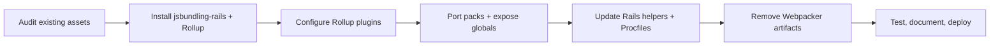

# Webpacker → jsbundling-rails Migration Plan

## Overall Context
- **Problem**: Webpacker/webpack 4 is unmaintained, complicates dependency management, and slows asset builds. Current packs mix JS, SCSS, and plugin assets (TinyMCE, DataTables, Selectize), making changes fragile.
- **Goal**: Replace Webpacker with [`jsbundling-rails`](https://github.com/rails/jsbundling-rails) using Rollup so assets build via standard Rails tooling, simplify dependencies, and keep runtime behavior unchanged.
- **Scope**: Application, BJC, and Schools packs (plus shared modules/styles) continue to exist; unused packs get removed. Deployment targets (Heroku/CI) must succeed with `bin/rails assets:precompile` invoking Rollup builds automatically.
- **Constraints**: Rails 6.1 app, Ruby 3.2, Node 14/16 engines. Keep ActionText/Trix styles bundled via JS imports; no switch to cssbundling-rails. Maintain jQuery-based behavior and TinyMCE customizations.

## Flow Overview

## Task Breakdown
| Phase | Description | Key Deliverables |
| --- | --- | --- |
| 1. Asset Inventory & Decisions | Catalog every pack, SCSS import, helper usage, and runtime dependency. Confirm `application`, `bjc`, `schools` are the only required entrypoints and document removals (`admin.js`, `w3.js`). | Inventory notes, decision log, list of untouched assets. |
| 2. Add jsbundling-rails (Rollup) | Add gem, run `bin/rails javascript:install:rollup`, commit generated scripts (`package.json` scripts, `bin/dev`, `rollup.config.js`). Update Procfile/Overmind commands to use Rollup watch. | Gem + npm updates, baseline Rollup config. |
| 3. Configure Rollup Plugins | Install/enable `@rollup/plugin-node-resolve`, `@rollup/plugin-commonjs`, `rollup-plugin-postcss` (or equivalent) for SCSS, font, and asset handling. Wire PostCSS/Babel reuse as needed. Ensure output goes to `app/assets/builds`. | Working Rollup build for sample entrypoint. |
| 4. Port Packs & Modules | Recreate `application`, `bjc`, `schools` entry files under Rollup, exposing `$`, `Selectize`, TinyMCE globals explicitly. Keep shared modules (`datatables.js`, images) and ActionText styles. Delete obsolete packs. | New entry files, updated imports, removed unused code. |
| 5. Update Rails Views & Helpers | Replace `javascript_pack_tag`/`stylesheet_pack_tag` with `javascript_include_tag` + `stylesheet_link_tag` pointing to Rollup outputs. Ensure layouts/partials (`application`, `page_with_sidebar`, `schools/_selectize_form`) reference digested builds and include `csrf_meta_tags`. | Updated ERB files, helper consistency checklist. |
| 6. Remove Webpacker Artifacts | Drop `webpacker` gem, `@rails/webpacker` npm package, webpack dev dependencies. Delete `config/webpacker.yml`, `bin/webpack*`, obsolete configs (`babel.config.js` if unused). Clean `yarn.lock` and ensure `yarn install` is reproducible. | Clean dependency set, no Webpacker files. |
| 7. Regression Testing & Docs | Run `bin/rails assets:precompile`, `bundle exec rspec`, `bundle exec cucumber`. Do smoke tests for TinyMCE/DataTables/Selectize flows. Update README or new doc with JS workflow instructions. | Test logs, documentation updates, deployment verification checklist. |

## Task 1 Findings – Asset Inventory

### Pack Usage Map
| Pack | View helpers | Notes |
| --- | --- | --- |
| `application` | `app/views/layouts/application.html.erb:9-10`, `app/views/layouts/page_with_sidebar.html.erb:9-10` | Primary pack; ships both JS + SCSS for every logged-in page. Must load before `bjc` so globals like `$` exist. |
| `bjc` | `app/views/layouts/page_with_sidebar.html.erb:11-12` | Supplements content pages with Work Sans fonts + W3 include helper for legacy curriculum content. Depends on `application` pack for jQuery globals. |
| `schools` | `app/views/schools/_selectize_form.html.erb:7-8` | Injected only on the school select component; currently loaded even though the same module is imported via the main pack. |

### Pack Contents & Runtime Dependencies
- **`app/javascript/packs/application.js:15-59`**
  - Uses `require.context('../images', true)` so every file under `app/javascript/images` is emitted and referenced through helpers. Rollup needs an equivalent glob import.
  - Imports jQuery and sets `window.$`, pulls in `jquery-ujs`, `bootstrap`, `popper.js`, and FontAwesome JS; also starts `@rails/ujs`.
  - Bundles TinyMCE core + icons, theme, plugins, and skin CSS along with DataTables (`datatables.net`, `datatables.net-bs4`, `datatables.net-buttons-bs4`, `datatables.net-buttons/js/buttons.html5.js`).
  - Pulls in shared modules (`./datatables.js`, `./schools.js`) and SCSS at `../styles/application.scss`. The schools module therefore runs twice (inside this pack and again when the standalone `schools` pack is loaded via the form partial).
  - Initializes Bootstrap tooltips via `$('[data-toggle="tooltip"]').tooltip()`.
- **`app/javascript/packs/bjc.js:3-32`**
  - Imports `../styles/bjc.scss` (which in turn includes `llab.scss` and local fonts/images).
  - Defines only the stripped down `w3.includeHTML` helper lifted from `w3.js`, then calls it on DOM ready: `$(() => w3.includeHTML());`. Assumes jQuery already erected by `application` pack.
- **`app/javascript/packs/schools.js:1-63`**
  - Imports `../styles/selectize.scss`, requires Turbolinks, Selectize, Bootstrap, and jQuery (without assigning to local vars; relies on Webpacker’s ProvidePlugin to inject `$`).
  - Adds AJAX submission for `#new_school`, toggles required fields, and wires Selectize create/change callbacks. Exposes `window.Selectize`.
- **Support modules**
  - `app/javascript/packs/datatables.js:1-72` extends `$.fn.dataTable` filters, configures buttons, and performs AJAX cross-filter lookups.
  - `app/javascript/packs/admin.js:1-27` duplicates the TinyMCE/DataTables imports but is unused (no helper references found).
  - `app/javascript/packs/w3.js:1-390+` ships the full W3 helper set but is unused; `bjc.js` carries the only method (`includeHTML`) that pages rely upon.

### Shared Styles & Static Assets
- **SCSS manifests**
  - `app/javascript/styles/application.scss:1-120+` imports Bootstrap SCSS, sets `$fa-font-path: '~@fortawesome/fontawesome-free/webfonts'`, pulls in FontAwesome partials, and includes local partials (`layout`, `forms`, `edit_teachers`, `merge_modal`, `sidebar`, `selectize`). Also documents legacy Sprockets `*= require selectize` comments.
  - `app/javascript/styles/bjc.scss:1-120+` imports `./llab.scss`, declares `@font-face` rules pointing at `../fonts/WorkSans-*.{woff,ttf}`, and references background images (e.g., `/bjc-r/img/globe.png`).
  - `app/javascript/styles/selectize.scss:1-3` imports CSS straight from the Selectize npm package.
  - `app/javascript/styles/actiontext.scss:1-34` brings in `trix/dist/trix` styles and overrides gallery rules, but no pack currently imports it—decide whether to hook it into Rollup or remove when confirmed unused.
- **Style partials** (`layout.scss`, `forms.scss`, `edit_teachers.scss`, `merge_modal.scss`, `sidebar.scss`, `llab.scss`) live beside the manifests; `llab.scss` uses multiple image URLs under `../img/...` (see `app/javascript/styles/llab.scss:139-550`).
- **Static directories**
  - Fonts (`app/javascript/fonts/*.woff|ttf`) consumed by `bjc.scss`.
  - Two image roots: marketing assets in `app/javascript/images/` (referenced via `require.context`) and curriculum art in `app/javascript/img/` (referenced via SCSS `url(../img/...)`). Both must be copied during bundling.

### External Packages & Loader Expectations
- `package.json:5-27` lists runtime dependencies: FontAwesome, ActionText wrapper, Rails UJS, Webpacker helper (to be removed later), Bootstrap 4, Choices.js, DataTables (core + Bootstrap + Buttons), jQuery, jquery-ujs, Popper.js, Selectize, TinyMCE, Trix, Turbolinks.
- Dev dependencies are `webpack`, `webpack-cli`, `webpack-dev-server`—these disappear once Rollup is installed.
- `config/webpack/environment.js:1-44` reveals current loader hacks:
  - `ProvidePlugin` supplies `$`, `jQuery`, and `Popper` globally so modules like `schools.js` can use `$` without importing.
  - Custom file-loader rules emit fonts, general SVG/woff assets, and copy TinyMCE skin files under `js/[path][name].[ext]`. There is also a CSS-loader exclusion for `.*skin.*` to prevent TinyMCE skins from being inlined.
- `postcss.config.js:1-11` configures `postcss-import`, `postcss-flexbugs-fixes`, and `postcss-preset-env`—Rollup’s CSS pipeline should reuse this.
- `babel.config.js:1-58` defines Babel presets/plugins for ES2015 transforms; determine whether Rollup still needs Babel or if browser targets are satisfied without it.

### Removal Candidates & Follow-ups
- Mark `app/javascript/packs/admin.js` and `app/javascript/packs/w3.js` for deletion once Rollup ports complete, since no view references them.
- `app/javascript/styles/actiontext.scss` appears orphaned; confirm whether ActionText is actually rendered anywhere before dropping it or remember to import it explicitly in the new build.
- `application` pack currently imports `./schools.js` even when the partial also loads `schools` as a dedicated pack—decide whether to keep both entrypoints or consolidate when porting to Rollup.
- Fonts under `app/javascript/fonts` and TinyMCE skins rely on Webpacker’s file-loader; ensure Rollup copies them or the UI will lose typography/editor chrome.

Task 1 is now complete and recorded; later phases should reference this section to ensure every dependency and asset path is covered when configuring Rollup.

## Task 2 Notes – jsbundling-rails Installation

- Added `jsbundling-rails` to the Gemfile (`Gemfile:17-18`) and installed it via Bundler (using Ruby 3.2.3 through rbenv). Bundler required network access and Ruby 3+, so commands must be run inside `eval "$(rbenv init -)"` when shelling into the repo.
- Ran `bin/rails javascript:install:rollup`, which generated:
  - `app/javascript/application.js` (placeholder entrypoint for now).
  - `rollup.config.js` targeting `app/assets/builds/application.js`.
  - `bin/dev` (Foreman launcher) and appended a `js: yarn build --watch` process to `Procfile.dev` so Rollup can watch builds.
  - An `app/assets/builds` output directory tracked via `.gitignore` plus `app/assets/builds/.keep`.
  - An initial `<%= javascript_include_tag "application", data: { turbo_track: :reload }, type: "module" %>` in `app/views/layouts/application.html.erb:9-13` (will be reconciled with pack tags during later cleanup).
- Installation attempted to run `yarn add --dev rollup @rollup/plugin-node-resolve` and `yarn build`, but Yarn refused because `package.json` restricted Node to `^14 || ^16` while the dev environment provides Node 22. Updated `package.json:26-28` to set `"node": ">=16"`, then reran `yarn add --dev rollup @rollup/plugin-node-resolve` successfully (requires network access) and confirmed `yarn build` emits `app/assets/builds/application.js`.
- Current Rollup config is the default single-entry ESM build with only the node-resolve plugin; subsequent subtasks will expand this to handle SCSS, CommonJS, TinyMCE assets, etc. (`rollup.config.js:1-13`).
- Procfile now includes both `webpack` and `js` processes; once packs are ported we will remove the webpack watcher entry to avoid redundant builds.

## Task 3 Plan – Rollup Plugin Configuration

1. **Catalogue build-time needs**: map each requirement surfaced in Task 1 (SCSS compilation, PostCSS autoprefixing, CommonJS modules, TinyMCE skin copying, fonts/images from `app/javascript/{images,img,fonts}`) to the Rollup plugins we need so there are no surprises later.
2. **Add build dependencies**: install the necessary Yarn packages (`@rollup/plugin-commonjs`, `rollup-plugin-postcss`, `rollup-plugin-copy`, `sass`, plus ensure `postcss`, `postcss-import`, `postcss-flexbugs-fixes`, `postcss-preset-env` are direct dependencies) so the build can process SCSS and assets independent of Webpacker.
3. **Revise `rollup.config.js`**: configure multi-entry output (object input + `dir: "app/assets/builds"`), wire in `nodeResolve`, `commonjs`, and `postcss` (reusing `postcss.config.js`), and add a copy step for fonts/images/TinyMCE skins. Provide hashed asset filenames so Rails helpers can point to `app/assets/builds`.
4. **Validate**: run `yarn build` to ensure the new plugin stack works before we start porting packs.

## Task 3 Notes – Rollup Plugin Configuration

- Added the required dev dependencies via Yarn so Rollup can handle CommonJS modules, SCSS/PostCSS, and static assets: `@rollup/plugin-commonjs`, `rollup-plugin-postcss`, `rollup-plugin-copy`, `sass`, plus explicit `postcss`, `postcss-import`, `postcss-flexbugs-fixes`, and `postcss-preset-env` (see `package.json:15-35`). These were already implicit via Webpacker but now live at the top level to survive when Webpacker is removed.
- Replaced the minimal Rollup config with a multi-entry friendly build that emits into `app/assets/builds` (`rollup.config.js:1-37`). Key capabilities now in place:
  - `@rollup/plugin-node-resolve` (`browser: true`) + `@rollup/plugin-commonjs` allow bundling jQuery/DataTables/TinyMCE CommonJS modules.
  - `rollup-plugin-postcss` (configured with `extract: true`, `sourceMap: true`, `use: ['sass']`) reuses `postcss.config.js` to compile SCSS (Bootstrap, FontAwesome, local partials) into standalone CSS assets under `app/assets/builds`.
  - `rollup-plugin-copy` mirrors `app/javascript/images`, `app/javascript/img`, and `app/javascript/fonts` into the build directory so any `image_pack_tag`/font references keep working once helpers switch to the new asset root.
  - Output naming now uses `[name].js` + hashed chunk/asset file names to prepare for multiple entrypoints in Task 4.
- Verified the setup with `yarn build`, which now produces `app/assets/builds/application.js(.map)` plus the copied `fonts/`, `images/`, and `img/` directories.
- Remaining gaps (to be addressed while porting packs): wiring actual entry files into Rollup, exposing globals, and ensuring CSS extraction naming matches how we’ll load the assets in layouts.

## Task 4 Plan – Port Packs & Modules
- **4.1 Prepare entrypoints**: replace the generated `app/javascript/application.js` with a Rollup entry that mirrors the current Webpacker pack (imports, globals, SCSS); create sibling entry files for `bjc` and `schools` under `app/javascript/entries/` (or similar) so Rollup can compile all three.
- **4.2 Configure multi-entry Rollup**: update `rollup.config.js` so `input` maps the three entry files to distinct bundles (e.g., `application`, `bjc`, `schools`); ensure CSS extraction produces matching filenames for each entry.
- **4.3 Restructure shared modules**: move `app/javascript/packs/datatables.js`, `schools.js`, and other shared helpers into a common location (`app/javascript/modules/`) and adjust imports accordingly; keep ActionText styles by importing `styles/actiontext.scss` where appropriate.
- **4.4 Ensure globals & dependencies**: explicitly attach `$`, `Selectize`, TinyMCE, and other globals to `window` where needed (since Rollup lacks ProvidePlugin); audit modules that previously relied on implicit globals or double imports.
- **4.5 Remove obsolete packs**: delete unused Webpacker packs (`admin.js`, `w3.js`) and any duplication once the new entrypoints compile successfully.
- **4.6 Validate**: run `yarn build` and manually inspect `app/assets/builds` outputs to confirm JS/CSS assets exist for all entrypoints before updating Rails layouts.

## Task 4 Notes – Port Packs & Modules

- **Entry files**: Replaced the placeholder `app/javascript/application.js` with the full application bundle (jQuery/TinyMCE/DataTables imports, ActionText styles, tooltip init) and added `app/javascript/bjc.js` plus `app/javascript/schools.js` as rollup entrypoints (`application`, `bjc`, `schools`).
- **Shared modules**: Moved the old pack-sidecar scripts into `app/javascript/modules/` (`datatables.js`, `schools.js`), converted them to ES modules, and ensured they import jQuery/Turbolinks/Selectize explicitly while guarding against double initialization. Deleted unused packs (`admin.js`, `w3.js`) along with the entire `app/javascript/packs/` directory.
- **Global dependencies**: Application entry now imports jQuery and assigns `window.$/window.jQuery`, exports `window.tinymce`, and loads TinyMCE skin CSS + DataTables plugins so CommonJS packages work without webpack's ProvidePlugin.
- **Rollup inputs + CSS**: Updated `rollup.config.js` to treat `application.js`, `bjc.js`, and `schools.js` as named inputs, copy static assets (images/img/fonts + FontAwesome webfonts) into `app/assets/builds`, and configure PostCSS/Sass to emit a single `application.css` (absolute path via `path.resolve`). All styles (application, ActionText, Bjc, Selectize, TinyMCE skins) now land in this CSS file; we’ll load it from Rails layouts in Task 5.
- **Build verification**: `yarn build` now produces `application.js`, `bjc.js`, `schools.js`, shared vendor chunk(s), and `application.css` alongside copied assets under `app/assets/builds/`. The legacy `bjc.css` output was removed to avoid confusion.

## Task 5 Plan – Rails View Updates & Cleanup
- **5.1 Replace helpers in layouts**: swap `javascript_pack_tag`/`stylesheet_pack_tag` in `app/views/layouts/application.html.erb` and `page_with_sidebar.html.erb` with `javascript_include_tag` / `stylesheet_link_tag` that point to the new Rollup outputs in `app/assets/builds` (e.g., `"application"`, `"bjc"`); ensure tags include `data-turbo-track="reload"` and `csrf_meta_tags` remain intact.
- **5.2 Update partial-specific assets**: adjust `app/views/schools/_selectize_form.html.erb` to load the new `schools` bundle via standard helpers instead of `javascript_pack_tag`/`stylesheet_pack_tag`, and remove redundant `csrf_meta_tags` in the partial since layouts already emit them.
- **5.3 Add stylesheet link for shared CSS**: since Rollup now emits `application.css`, ensure both layouts include `<%= stylesheet_link_tag "application", "data-turbo-track": "reload" %>` so global styles apply everywhere.
- **5.4 Remove Webpacker-specific references**: delete any remaining pack-related helpers (e.g., `image_pack_tag`) or update them to use the standard asset helpers pointing at `app/assets/builds` (e.g., `asset_path`). If replacements are risky, note follow-ups.
- **5.5 Validate**: run `yarn build` and boot the app (or inspect rendered HTML) to confirm the new helpers reference the expected files; ensure `RAILS_ENV=production bin/rails assets:precompile` will pick up the new tags (sanity check by verifying the manifest).

## Task 5 Notes – Rails View Updates & Cleanup
- Added `config/initializers/assets.rb` to add `app/assets/builds` to the asset pipeline search path and precompile the Rollup entrypoints (`application.js`, `bjc.js`, `schools.js`, `application.css`). This ensures `assets:precompile` picks up the generated bundles and any relative imports (like `images/*`).
- Updated both layouts to use the standard helpers:
  - `app/views/layouts/application.html.erb:1-20` now includes `<%= stylesheet_link_tag "application", data-turbo-track: "reload" %>` and `<%= javascript_include_tag "application", ..., type: "module" %>` instead of `javascript_pack_tag`/`stylesheet_pack_tag`.
  - `app/views/layouts/page_with_sidebar.html.erb:1-18` loads the application bundle plus the BJC-specific bundle via `javascript_include_tag "bjc", ...` (no separate CSS since everything extracts into `application.css`).
- The selectize form partial (`app/views/schools/_selectize_form.html.erb:1-11`) now pulls in `schools.js` via `javascript_include_tag` and drops the redundant stylesheet/CSRF tags (CSS already lives in the global bundle, and CSRF meta tags belong in the layout).
- Replaced remaining `image_pack_tag` usages with `image_tag('images/...')` in the navbar and footer so they resolve via the asset pipeline now that `app/assets/builds/images` is on the asset path.
- Ran `yarn build` to verify the new layout/helper setup still produces the expected bundles; no functional changes to the build output beyond regenerated timestamps.

## Task 6 Plan – Remove Webpacker Artifacts
- **6.1 Remove gem + configs**: delete the `webpacker` gem from the Gemfile, run `bundle install`, and remove `config/webpacker.yml`, the entire `config/webpack/` directory, and the old Babel config/binstubs (`babel.config.js`, `bin/webpack*`).
- **6.2 Clean up npm dependencies**: strip `@rails/webpacker` from `package.json` dependencies and drop the webpack devDependencies (`webpack`, `webpack-cli`, `webpack-dev-server`); run `yarn install` to refresh `yarn.lock`.
- **6.3 Update tooling**: remove the `webpack` process from `Procfile.dev` (now only `web` + `js`), ensure `bin/dev` still works, and delete any lingering references to Webpacker output directories in `.gitignore` or docs.
- **6.4 Verify**: run `bundle exec rails -v` (or `bin/rails runner 'puts :ok'`) plus `yarn build` / `bin/rails assets:precompile` as needed to ensure no code still references Webpacker.

## Task 6 Notes – Remove Webpacker Artifacts
- Dropped the `webpacker` gem from the Gemfile and reran Bundler, then deleted the leftover configuration (`config/webpacker.yml`, `config/webpack/*`, `babel.config.js`, `bin/webpack*`).
- Removed `@rails/webpacker` and all webpack dev dependencies from `package.json`, ran `yarn install` to refresh `yarn.lock`, and cleaned `.gitignore` / `Procfile.dev` so only the jsbundling watch process remains.
- Added `config/initializers/assets.rb` plus `app/assets/config/manifest.js`, and re-enabled `require "sprockets/railtie"` in `config/application.rb` so Sprockets can serve `app/assets/builds`. The initializer also copies in the Rollup bundles (`application.js`, `bjc.js`, `schools.js`, `application.css`).
- Verified the Rails app boots (`bin/rails runner 'puts :ok'`) and reran `yarn build` to ensure everything still compiles without Webpacker.

## Task 7 Plan – Regression Testing & Docs
- **7.1 JS build sanity**: run `yarn build` and confirm the three entrypoints (`application`, `bjc`, `schools`) plus `application.css` are generated under `app/assets/builds`.
- **7.2 Production precompile**: run `RAILS_ENV=production bin/rails assets:precompile` (with temporary `SECRET_KEY_BASE`) to verify Rails + Sprockets can digest Rollup outputs end-to-end.
- **7.3 Automated tests**: run `bundle exec rspec` and `bundle exec cucumber`; record any infra blockers separately from migration regressions.
- **7.4 Smoke-test checklist**: document manual checks for TinyMCE, DataTables, and Selectize flows for local QA/staging signoff.
- **7.5 Handoff docs**: capture exact commands, known warnings, and unresolved environment constraints so CI/prod validation is repeatable.

## Task 7 Notes – Regression Testing & Docs
- `yarn build` succeeds and emits expected bundles in `app/assets/builds` (`application.js`, `bjc.js`, `schools.js`, `application.css`, plus copied fonts/images).
- `RAILS_ENV=production` precompile now succeeds end-to-end using:
  - `SKIP_YARN_INSTALL=1 SECRET_KEY_BASE=temporary_key_for_precompile RAILS_ENV=production bin/rails assets:precompile`
  - Result: digested JS/CSS/assets are written into `public/assets`.
  - Note: Rollup/Sass emits deprecation warnings (Bootstrap 4 + `@import` syntax); these are non-blocking for this migration and can be handled as follow-up tech debt.
- `bundle exec rspec` and `bundle exec cucumber` both fail in this sandbox due to database connectivity restrictions to PostgreSQL on `localhost:5432` (`PG::ConnectionBad` / `ActiveRecord::ConnectionNotEstablished`). This is an environment limitation, not a jsbundling runtime error.
- During precompile verification, asset manifest setup was corrected to avoid missing image-tree errors:
  - `app/assets/config/manifest.js` now links only `../builds`.
- Manual smoke-test checklist to run outside sandbox:
  - TinyMCE editor loads with toolbar/icons/skins on pages that use rich text.
  - DataTables screens render, filter, and export buttons work.
  - School Selectize form initializes once and supports create/change + AJAX submit path.
  - BJC pages still execute `w3.includeHTML()` and render Work Sans/font assets correctly.

## Estimated Effort
- Total: **≈3 engineering days** (inventory 0.5d, install/config 0.75d, port packs 1d, views + cleanup 0.75d, testing/docs 0.25d).
- Risk drivers: Rollup plugin setup for CSS/assets, ensuring globals work without Webpacker magic, keeping deployment scripts aligned.

## Success Criteria
- `yarn build` and `bin/rails assets:precompile` succeed without Webpacker.
- Browser smoke tests confirm DataTables, TinyMCE, Selectize, ActionText editors behave the same.
- Dependency tree no longer includes Webpacker/webpack, and onboarding docs point to the new Rollup workflow.
